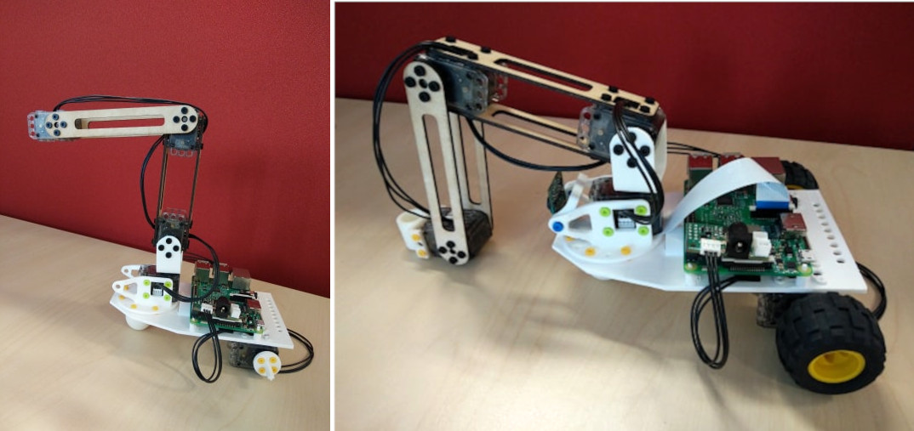

# poppy-dragster-mini

Poppy Dragster mini is a educational robot based on a Poppy Ergo Jr that comes in the form of a small robotic arm with 4 degrees of freedom mounted on a pedestal with two wheels. The plastic parts can be 3D printed.

[STL View >>](doc/stl/poppy_dragster_mini.stl)

[BOM >>](hardware/parts/BOM.md)
